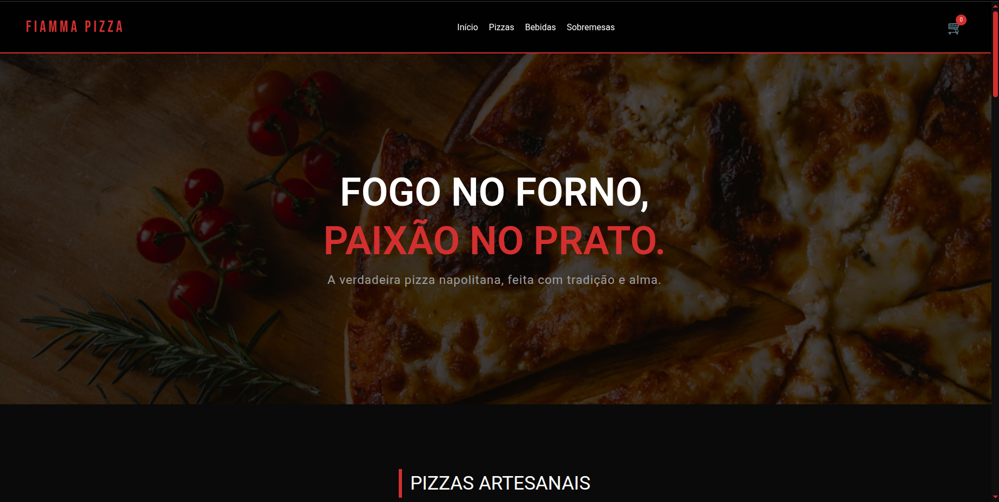
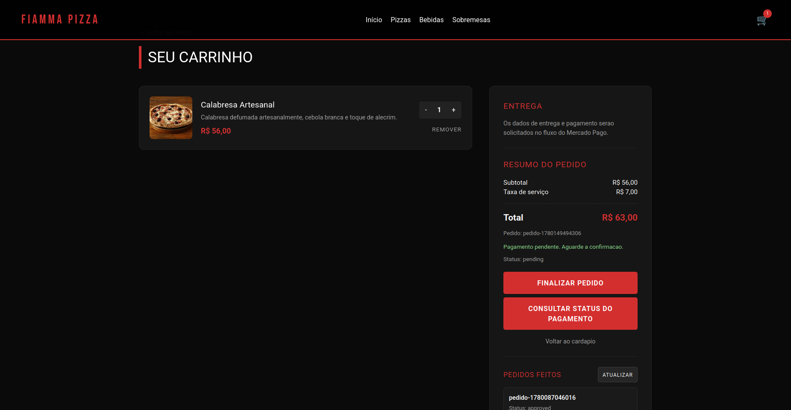
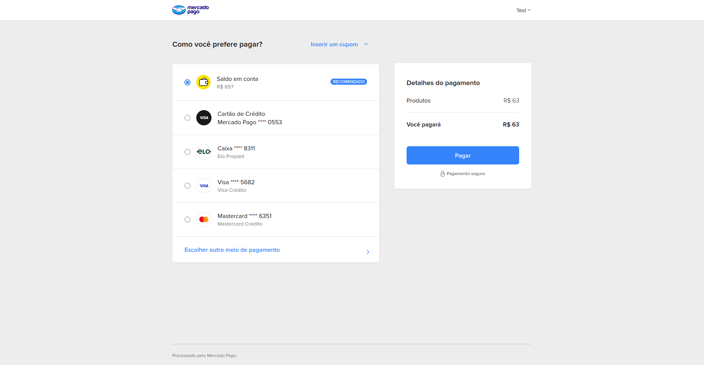

<div align="center">
  

  <h1>🍕 Fiamma Pizza</h1>

  <p>
    A modern Angular storefront for a Neapolitan-inspired pizzeria, with menu browsing,
    persistent cart state, payment flow, and order status tracking.
  </p>

  <p>
    <a href="#english">English</a> •
    <a href="#portugues">Português</a> •
    <a href="#screenshots">Screenshots</a> •
    <a href="#license">License</a>
  </p>
</div>

---

## Tech Stack

<div align="center">


</div>

---

## English

### Project Overview

**Fiamma Pizza** is a digital storefront for a Neapolitan-inspired pizzeria. It presents the brand, organizes the menu into product sections, lets customers add pizzas to a persistent cart, and connects the order flow to a payment API.

The project’s goal is to deliver a polished online ordering experience: strong visual identity, direct navigation, responsive UI, cart management, checkout integration, and payment/order status feedback.

### Main Sections

| Section | Description |
| --- | --- |
| **Home** | Brand hero with the main tagline and dark/red visual identity. |
| **About** | Short institutional section focused on the handcrafted pizzeria concept. |
| **Menu** | Product categories with images, descriptions, prices, and add-to-cart actions. |
| **Cart** | Item review, quantity controls, removal actions, and order summary. |
| **Payment** | Payment preference creation, external checkout opening, and status lookup. |
| **Completed Orders** | Simple list of finalized orders returned by the API. |

### Features

- API-based menu loading through `/api/menu`.
- Reactive cart state powered by Angular Signals.
- Cart persistence using `localStorage`.
- Quantity update and item removal controls.
- Subtotal, service fee, and total calculation through the API.
- Payment preference creation for external checkout.
- Payment status lookup by external order reference.
- Finalized order listing.
- Responsive layout built with Tailwind CSS.
- Custom scrollbar matching the project’s visual identity.

### Running Locally

```bash
npm install
npm start
```

Then open:

```text
http://localhost:4200/
```

Useful commands:

```bash
npm run build
npm test
```

---

## Screenshots

### Cart Review



### Payment Flow



---

<a id="portugues"></a>

## Português

### Visão Geral

**Fiamma Pizza** é uma vitrine digital para uma pizzaria de inspiração napolitana. O projeto apresenta a marca, organiza o cardápio em seções de produtos, permite adicionar pizzas a um carrinho persistente e conecta o fluxo do pedido a uma API de pagamentos.

O objetivo é entregar uma experiência de pedido online bem-acabada: identidade visual forte, navegação direta, interface responsiva, gerenciamento de carrinho, integração com checkout e retorno de status do pagamento/pedido.

### Principais Seções

| Seção | Descrição |
| --- | --- |
| **Início** | Hero da marca com chamada principal e identidade visual escura/vermelha. |
| **Sobre** | Seção institucional curta focada na proposta artesanal da pizzaria. |
| **Cardápio** | Categorias de produtos com imagens, descrições, preços e ações de adicionar. |
| **Carrinho** | Revisão dos itens, controle de quantidade, remoção e resumo do pedido. |
| **Pagamento** | Criação de preferência, abertura do checkout externo e consulta de status. |
| **Pedidos Feitos** | Lista simples de pedidos finalizados retornados pela API. |

### Funcionalidades

- Cardápio carregado via API em `/api/menu`.
- Estado reativo do carrinho com Angular Signals.
- Persistência do carrinho usando `localStorage`.
- Controle de quantidade e remoção de itens.
- Cálculo de subtotal, taxa de serviço e total via API.
- Criação de preferência de pagamento para checkout externo.
- Consulta de status por referência externa do pedido.
- Listagem de pedidos finalizados.
- Layout responsivo construído com Tailwind CSS.
- Barra de rolagem personalizada de acordo com a identidade visual.

### Como Executar

```bash
npm install
npm start
```

Depois acesse:

```text
http://localhost:4200/
```

Comandos úteis:

```bash
npm run build
npm test
```

---

## License

This project is licensed under the **MIT License**. See the full text in [`LICENSE`](LICENSE).
